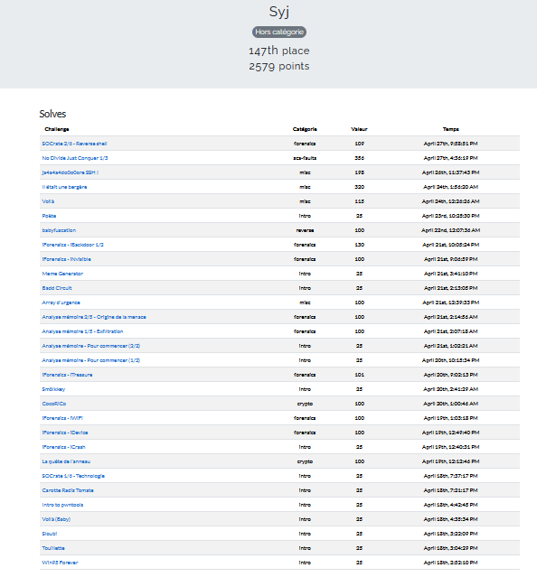
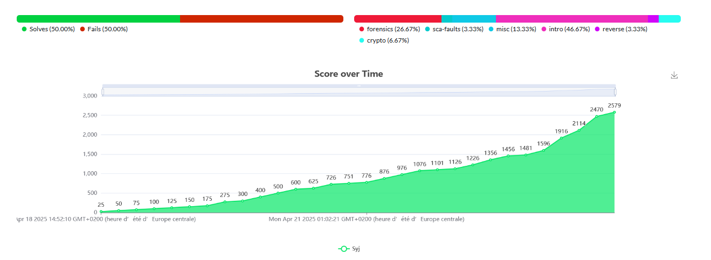

# France Cyber Security Challenge (FCSC) 2025

Like every year, ANSSI organizes a competition to select the French team for the [European Cybersecurity Challenge ECSC](https://ecsc.eu/).

I am too old and I definitely do not have the level to join the French team, but I regularly participate in this competition because it allows me to develop all my skills.

Every year, I try to improve my ranking.

In these directories, you'll find the tools I use for the Forensics Challenge, as well as some articles.

## Tools

Below is a subset of the tools used in this CTF

You can find these tools & others in the docker image located in the tools folder

```bash
cd tools
docker-compose up --build
```

Other tools

[Ghidra](https://ghidra-sre.org/) 
A software reverse engineering (SRE) suite of tools developed by NSA's Research Directorate in support of the Cybersecurity mission

[Volatility3](https://github.com/volatilityfoundation/volatility3)  
The volatile memory extraction framework


[SageMath](https://www.sagemath.org/)

```bash
docker run -p8888:8888 sagemath/sagemath:latest sage-jupyter
```

## Write-ups

[intro/Poete](poete/README.md)

[intro/smolkkey](smolkkey/README.md)


[misc/Ja4a4a4do0o0ore](ja4a4a4do0o0ore/README.md)

[misc/Bergere](bergere/README.md)


[sca-faults/No Divide Just Conquer 1/3](noDivideJustConquer/README.md)


## Ranking & scores





## Thanks

Thank you to all the ANSSI teams for this great competition.