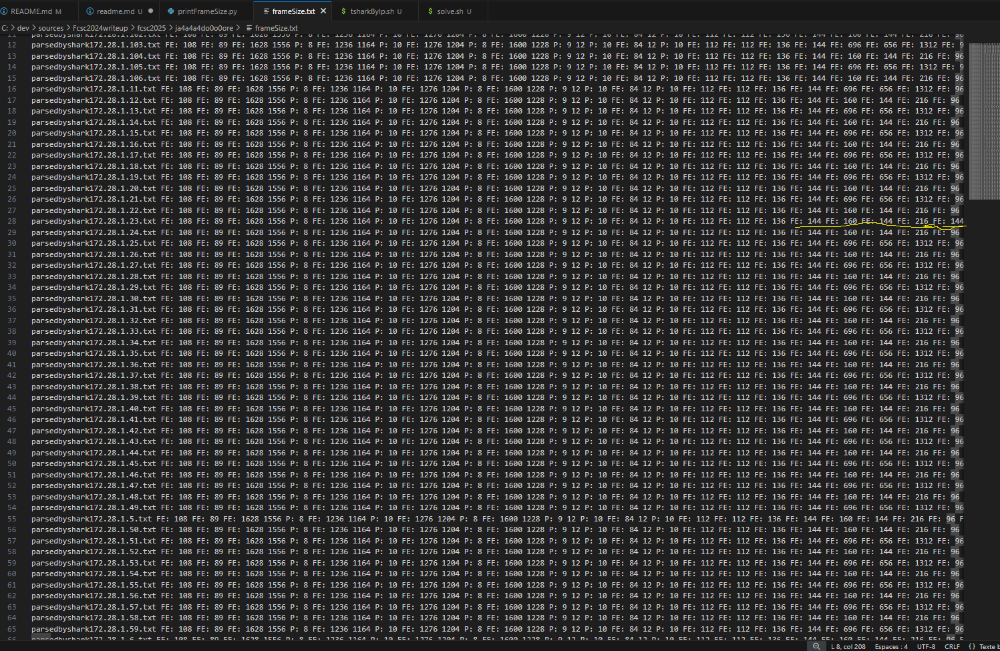

# ja4a4a4do0o0ore SSH !

[Subject](https://hackropole.fr/fr/challenges/misc/fcsc2025-misc-ja4a4a4do0o0re-ssh/)

The goal is to identify an interactive connection among SSH connections with certificate

A first script allow me to separate each communication by ip
It use tcpdump to extract a list of ip
tshark to decode usefull information in session SSH.

```bash
FILEPCAP=ja4a4a4do0o0re-ssh.pcap
# `tcpdump -r ja4a4a4do0o0re-ssh.pcap -nn -q | awk '{print $3}'|cut -d \. -f 1,2,3,4 |sort|uniq`
for ip in `tcpdump -r ja4a4a4do0o0re-ssh.pcap -nn -q | awk '{print $3}'|cut -d \. -f 1,2,3,4 |sort|uniq`
do
    echo $ip
    tshark  -r ${FILEPCAP} -d tcp.port==2222,ssh -Y "ip.addr ==  ${ip} && ssh" -V > parsedbyshark${ip}.txt
done
```

Tshark allow to identify  available algorithm and SSH cookie session

I quickly noticed that tshark did not allow me to identify the interactive SSH connection

A search tells me that it is not possible to identify interactive sessions from other sessions.
So, the solution was to seek for a side-channel.

Th code bellow dump by ip each frame size. 

```bash
python printFrameSize.py > frameSize.txt
```

With Visual Studio, i identify the first frame which is only different on one connexion



With, the first script, we can identify cookie in tshark result.


FLAG: FCSC{f24e0ff9dc4c1c005d5f3aaac4853575-90c7d30853db0f93bc8dad28c7b62b4d}

